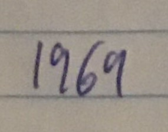

# HandwritingAI

HandwritingAI is a Python project to transcribe words from images of my handwriting. 

The goal of this project is to be able to take images as input (in my handwriting) and for a machine learning model to be able to read what is written and convert this to text.

Images are read in where they are processed to be black and white, these images are then split into lines and then the lines are further split into images of individual words. These individual words can be saved to a folder to be labeled for tailored dataset creation for model training, or they can be passed to a pre-trained model to be transcribed.

This project includes some pre-trained models most of which are trained on my handwriting specifically however there is also a model trained on the [IAM words dataset](https://doi.org/10.1007/s100320200071). You can use these models to transcribe images, or you can create your own dataset which is semi-automated. It should be noted that I started seeing "passable" transcriptions at a sample size of approximately 5000 words.
## Installation
Clone this repository and then depending on what packages you already have installed you may need to install the following using the package manager [pip](https://pip.pypa.io/en/stable/) or other methods.

```bash
pip install numpy
pip install opencv-python
pip install scipy
pip install mltu
pip install tk
pip install pillow
```

## Usage
If you just want to transcribe an image using either my specific handwriting model or the more general IAM trained model then you should just run main.py and follow the instructions that pop up in the terminal.

However, if you are wanting to train your own model then you will need lots of images containing your writing. You will need to run write_words_from_image() (this is quite slow takes roughly 25 seconds per image) and then run dataset_creation.py with all paths correctly specified. Then you will need to run model_train.py, and finally you will need to alter main.py to run with the new model.

## Examples
  Transcribed as pos
<br>
  Transcribed as because
<br>
  Transcribed as seremg
<br>
  Transcribed as jumped
<br>
  Transcribed as test
<br>
  Transcribed as thah
<br>
  Transcribed as This
<br>
  Transcribed as wranted
<br>
  Transcribed as sphnx
<br>
  Transcribed as science
<br>
  Transcribed as 1961
<br>
  Transcribed as mouse
<br>

## License

[MIT](https://choosealicense.com/licenses/mit/)
